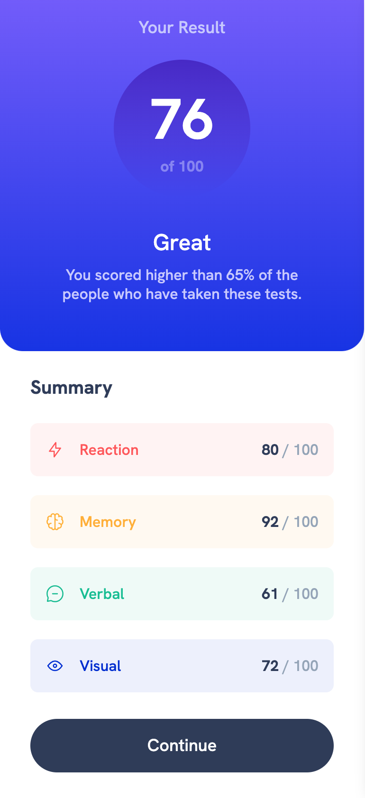
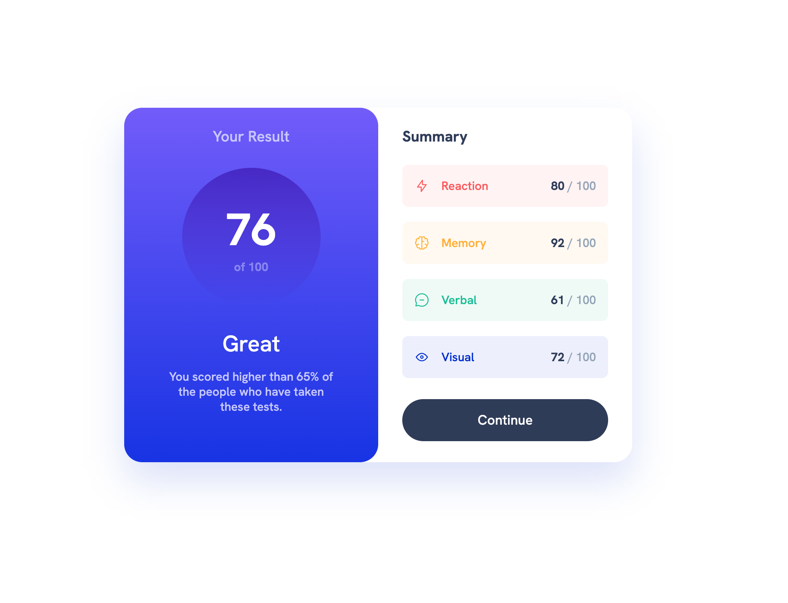

# Frontend Mentor - Results summary component solution

This is a solution to the [Results summary component challenge on Frontend Mentor](https://www.frontendmentor.io/challenges/results-summary-component-CE_K6s0maV). Frontend Mentor challenges help you improve your coding skills by building realistic projects.

## Table of contents

- [Overview](#overview)
  - [The challenge](#the-challenge)
  - [Screenshot](#screenshot)
  - [Links](#links)
- [Author](#author)

## Overview

### The challenge

Users should be able to:

- View the optimal layout for the interface depending on their device's screen size
- See hover and focus states for all interactive elements on the page

### Screenshot

### Links

- Solution URL: [https://github.com/masomaster/frontend-mentor-results-summary](https://github.com/masomaster/frontend-mentor-results-summary)
- Live Site URL: [https://masomaster.github.io/frontend-mentor-results-summary/](https://masomaster.github.io/frontend-mentor-results-summary/)

## My process

### Built with

- Semantic HTML5 markup
- Tailwind CSS
- Flexbox
- CSS Grid
- Mobile-first workflow

## Author

- Website - [Mason Lancaster](https://masonlancaster.com/)
- Frontend Mentor - [@masomaster](https://www.frontendmentor.io/profile/masomaster)
